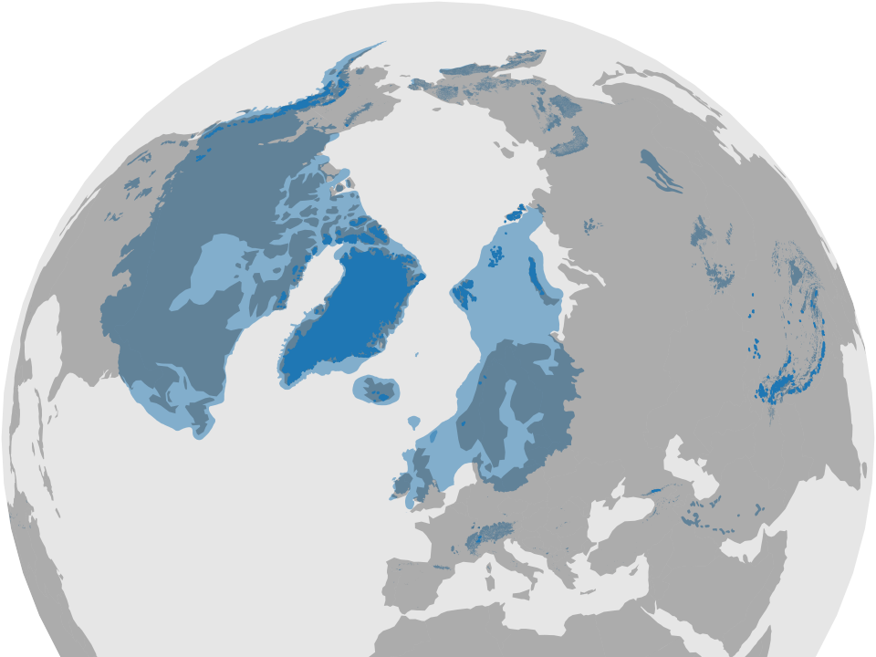

<!-- Towards global mountain paleoglacier modelling for academia and society -->

<!-- should this be in template? -->
<section data-markdown data-separator-notes="^Note:">
<textarea data-template>

# Towards global mountain paleoglacier modelling
for academia and society

&nbsp;

[Julien Seguinot](https://juseg.github.io), 2 Sep. 2022.

---

### 2011: getting the right tools

<!-- note: can't fragment content-list in pure markdown -->
<ul><li class=fragment>

  Use [PISM](https://pism.io) to compute fake ice sheet.

  ```bash
  # run PISM for 120000 years
  pismr -boot_file "topography.nc" \
      -y "120000" -o "icesheet.nc" \
      [...]
  ```

</li><li class=fragment>

  Use [Python](https://python.org) to make it look real.

  ```python
  import netCDF4 as nc4
  import matplotlib.pyplot as plt

  # make a nice figure
  plt.imshow(nc4.Dataset("icesheet.nc"))
  [...]
  ```

</li></ul>

---

### 2018: modelling for outreach

<div class="r-stack r-stretch">
  
  
</div>

Mémoire de glace
  ([Sion](https://www.musees-valais.ch/musee-histoire/expositions/archives/item/1229-memoire-de-glace-vestiges-en-peril.html),
  [Nemours](https://www.musee-prehistoire-idf.fr/fr/memoire-de-glace))
[etc](https://juseg.github.io/outreach/).

---

<!-- .slide: data-background-iframe="https://player.vimeo.com/video/294517816?autoplay=1&loop=1&color=ffffff&title=0&byline=0&portrait=0" -->

---

### 2022: going global



Note: Sea level equivalents
- Antarctica: 58.3 m s.l.e. (Fretwell et al., 2013)
- Greenland: 7.3 m s.l.e. (Bamber et al., 2013)
- Additional 120 to 135 m s.l.e. (Clark and Mix, 2002)

---

## Hyoga plotting library

<iframe data-src="https://hyoga.readthedocs.io" width="1040" height="540"></iframe>

---

## Future plans

* **[v0.1.2](https://github.com/juseg/hyoga/releases/tag/v0.1.2)** (Aug. 2022):
  Plotting and interpolation

  ```python
  import xarray as xr
  import hyoga
  ds = xr.open_dataset('coarse.nc')
  ds.interp('fine.nc').hyoga.plot_surface_altitude()
  ```

* **v0.2.0** (Oct. 2022): Cartographic backgrounds

* **Future** (2023-2025):
  - CF-compliant input files
  - Multiple model domains
  - Outreach tools

<!-- should this be in template? -->
    </textarea>
</section>
