<!-- can't ne moved to template -->
<section data-markdown data-separator-notes="^Note:">
<textarea data-template>

# Towards global mountain paleoglacier modelling

 

&nbsp;

[Julien Seguinot](https://juseg.github.io) & Suzette Flantua, 20 Sep. 2022.

<!-- Trond Mohn Foundation   BIO, UiB & BCCR -->

---

<!-- Alps cycle zoomout movie -->

<!-- .slide: data-background-iframe="https://player.vimeo.com/video/294517816?autoplay=1&loop=1&color=ffffff&title=0&byline=0&portrait=0#t=45s" -->

---

### Hyoga plotting library

<iframe data-src="https://hyoga.readthedocs.io/en/latest"
        width="1040" height="540"></iframe>

---

### Biome connectivity

---

### Links

https://hyoga.readthedocs.io

https://mountainsinmotion.w.uib.no

<!-- can't be moved to template -->
</textarea>
</section>
