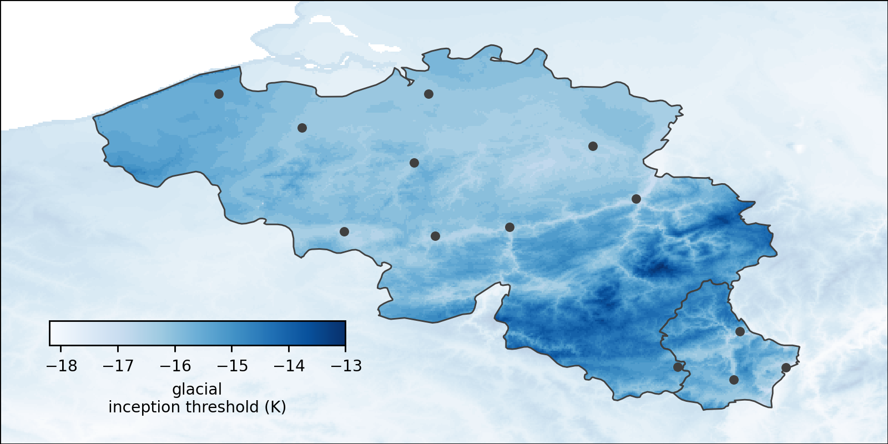

<!-- can't be moved to template -->
<section data-markdown data-separator-notes="^:::">
<textarea data-template>

<!-- .slide:
  data-background-image="https://live.staticflickr.com/65535/53678099600_2d9af5dcc9_k.jpg" -->

**Mountain paleoglacier modelling beyond the Alps**,
[J. Seguinot](https://juseg.dev), VUB, 15 Oct 2024.

### Gorner Glacier, CH
<!-- .element: class="fragment" data-fragment-index="1" -->

Photo: [2017](https://www.flickr.com/photos/pyjeo/53678099600/)
<!-- .element: class="credit fragment" data-fragment-index="1" -->

::: An active deglaciation landscape in the Alps:
- Gorner Glacier has recently become two glaciers.
- I want you to look at the Little Ice Age moraines.
- The landscape record is sparse in time and space.

---

### The Alps now and then

  

    
  

  

    
  

Glacier Garden Museum Lucerne &#169;
[Samuel Bucheli](https://samuelbucheli.myportfolio.com/stereoscopic-time-machine-alpenblick).

---

### Paleoglacier modelling
<!-- .element: style="display: none" -->

<!-- .slide: data-background-iframe="https://player.vimeo.com/video/294517816?autoplay=1&loop=1&color=ffffff&title=0&byline=0&portrait=0#t=45s" -->

---

### Going global

  
  

-4.8°C ?
<!-- .element: class="blue fragment" style="bottom: 0; margin: 0; padding: 1em 2em; position: absolute; font-size: 2em" -->

---

### Glacial inception map

  
  
  
</div/

<!-- .element: class="credit" -->
<!-- can't be moved to template -->
</textarea>
</section>
