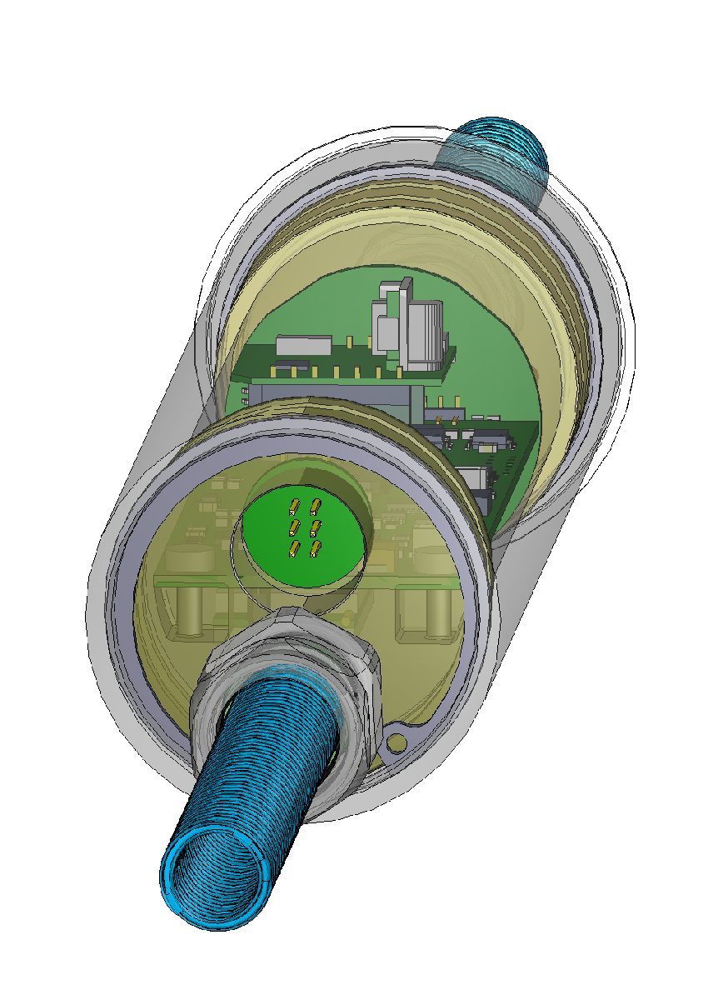
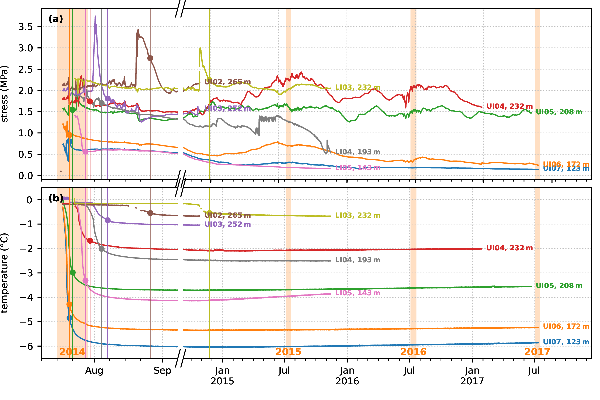
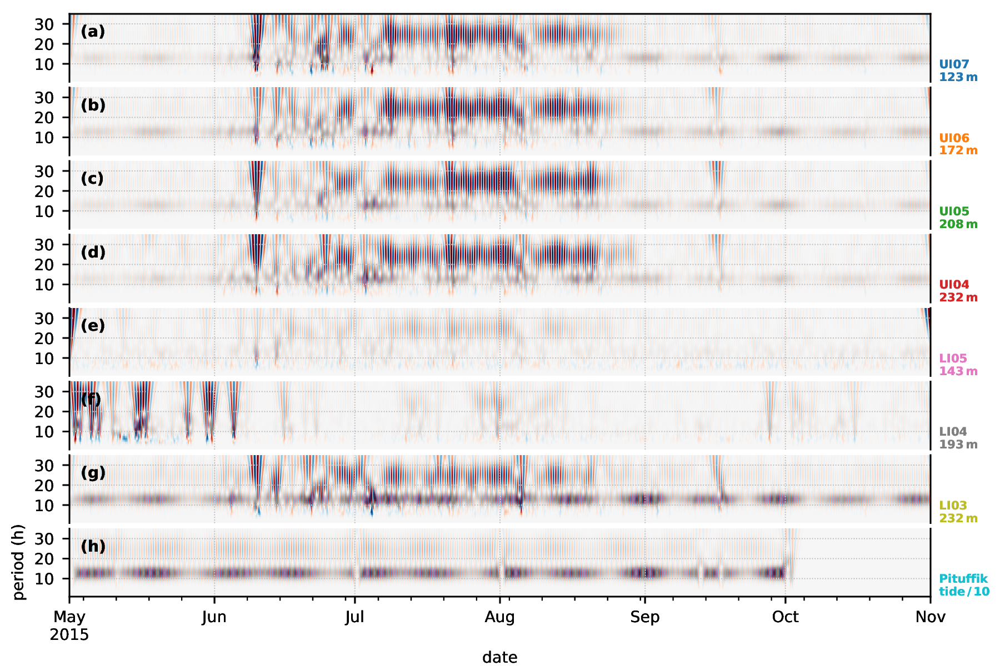

<!-- can't be moved to template -->
<section data-markdown data-separator-notes="^:::">
<textarea data-template>

# Can we measure stress in glaciers?

~

*The mass of glaciers lead lives of constant stress, 
so they relax by slowly gliding on their bed.*

~

[J. Seguinot](https://juseg.dev) & E. Podolsky.
VUB, 06 Nov 2024.

---

### Bowdoin Glacier, GL

<!-- .slide: data-background-image="https://live.staticflickr.com/65535/49298829236_2546afe01d_k.jpg" -->

---

### Colleagues for scale

<!-- .slide: data-background-iframe="https://flickr.com/photos/snsf_image_competition/49724736328/" -->

<small>Video: [E. van Dongen, 2017](
    https://flickr.com/photos/snsf_image_competition/49724736328/)</small>

---

### View from the fjord  <!-- .element: style="display: none" -->

<!-- .slide: data-background-video="https://live.staticflickr.com/video/40630777905/ee55a06c9b/1080p.mp4?s=eyJpIjo0MDYzMDc3NzkwNSwiZSI6MTczMDgyNzM3MCwicyI6ImRmZWEzNTBmMjQ1MzkyMjkzYjRkYmRmYTM3ZmM2ODI2ZWJmN2RhYjMiLCJ2IjoxfQ" -->

Video: [L. Preiswerk, 2017](
    https://flickr.com/photos/snsf_image_competition/40811455004/)

<!-- .element: class="credit" -->

---

### Borehole site

<!-- .slide: data-background-image="https://live.staticflickr.com/65535/49298343083_3bfbd1cc01_k.jpg" -->

---

### Bowdoin borehole locations

 <!-- .element height="320px" -->
 <!-- .element height="320px" -->

::: Figure 1: (a) Bowdoin borehole locations from drilling in July 2014 to
dismantling in July 2017 and background satellite image from 2017 March 10,
17:41:29 UTC. Contains modified Copernicus Sentinel data, processed with
Sentinelflow. (b) Initially observed ice thickness and localization of the
piezometers as deduced from initial water-pressure measurements. [TODO: add
model of tilt unit casing with location of the sensor] .

---

### Three-year borehole record

::: Figure 3: (a) Same as Fig. 2 but with split axes. Sharp peaks in the early part
of the record cor- respond to the hotwater-drilled borehole refreezing phase.
(b) Corresponding temperature record, showing the initial refreezing phase and
long-term warming (cf. Seguinot et al., 2020). Full circles denote refreezing
dates estimated Insets displaying an example of semi-diurnal periodic
oscillations observed in the stress record after refreezing. [NOTE: Maybe this
can be merged with Fig. 2.]

---

### Zooming in on the stress record

::: Figure 2: (a) Complete piezometer record, including the initial borehole water
pressure measure- ments, and the transition to solid ice stress measurements.
(b, c) Insets displaying an example of semi-diurnal periodic oscillations
observed in the stress record after refreezing.

---

### High-pass filtering

::: Figure 4: (a) Complete piezometer record, after applying a fourth-order
Butterworth high-pass filter with a cut-off period of one day. The bottom curve
shows (non-filtered) tidal measurements from Pituffik, converted to sea-water
pressure and divided by ten. (b) Zoom on the later part of the 2014 melt season
and transition into fall, before contact to UI03 and UI02 was lost, but also
while LI03 was not yet refrozen. Other sensors record a transition from
high-amplitude, daily stress oscillations (correlated with glacier speed) to
semi-diurnal oscillations anti-correlated with, and an order of magnitude lower
than, the tide. [NOTE: maybe add a separate figure with borehole temp and
stress during refreezing.] [TODO: fix year label, add GPS and tilts, and
highlight the freezing dates?]

---

### Fast Fourier transform

::: Figure 5: (a–i) Fast-fourier transforms of the (non-filtered) series of stress
derivative over time (kPa s−1 ) after refreezing. The refreezing date is
computed independently for each unit as the date when temperatures reach 75% of
their minumum value relative to 0 C◦ . [TODO: ensure this is consistent among
plots.] (j) Fast-fourier transform of the time derivative of Pituffik tides,
converted to sea-water pressure and divided by ten. Insets show a zoom on the
diurnal and semi-diurnal tidal components which can also be found in some of
the stress records.

---

### Rolling-window spectrograms

::: Figure 6: (a–h) Rolling-window spectrograms of glacier stress and tidal pressure temporal deriva-
tives after refreezing of the individual units. Fourier transforms are computed on 14-day windows
with a 12-day overlap. Some of the vertical bands result from interpolating the signal from solar-
power-adaptive to a constant, ten-minute time step. Colour curves indicate the relative ratio of
spectral power between the 10–14 and 22–26 h bands, rescaled between 12 and 24 h for visualization,
showing that semi-diurnal oscillations dominate the record outside the melt season. UI03 and UI02
are omitted due to the short length of their solid stress record after refreezing.

---

### Wavelet transforms

::: Figure 7: (a–h) Continuous wavelet transforms of glacier stress and tidal pressure temporal deriva-
tives after applying a fourth-order Butterworth high-pass filter with a cut-off period of one day
[TODO: maybe filtering is not needed here] , showing the emergence of a diurnal signal during the
2015 melt season, in addition to the persistent semi-diurnal signal. [TODO: try and extend upwards
to 14-days periods.] [NOTE: I do not yet master this. I tried to plot the CWT for longer record,
but the magnitude of 12 and 24-h oscillations appears to diminish as I extend the time period. On
the other hand the CWT seems to be good at picking the changes in frequency at the beginning and
the end of the melt season.]

---

### Cross-correlation over a month

::: Figure 8: (a) Extract of the piezometer record and tidal pressure for October 2014, after applying
a fourth-order Butterworth band-pass filter with cut-off periods of 0.5 and 12 h. [TODO: try 15 h,
or maybe even use the same filter in all plots.] (b) Cross-correlation of the ice stress (and water
pressure) time series against tidal pressure. Coloured dots indicate the maximum absolute correla-
tion, which corresponds to an anti-correlation with a phase delay of ca. 1–2 h. (c) Corresponding
phase delay as a function of sensor depth. [TODO: fix labels, check that the clocks are on-time
(at least UI* should be OK, but I’m not sure about LI*).]

---

### Rolling-window cross-correlation

::: Figure 9: (a-g) Rolling-window cross-correlation between the piezometer and tidal pressure record
when the latter is available, after applying a fourth-order Butterworth band-pass filter with cut-off
periods of 2 and 12 h. Colour curves show the optimal phase delay of stress records relative to
tides when absolute maximum (anti)correlation is above 0.75. [NOTE: no idea what happens after
2016.] [TODO: add colorbar (grey=anticorrelation), try 1-bit normalization] .

---

### TBC next year

<!-- .slide: data-background-image="https://live.staticflickr.com/65535/49019299958_58fc296068_k_d.jpg" -->

<!-- can't be moved to template -->
</textarea>
</section>
