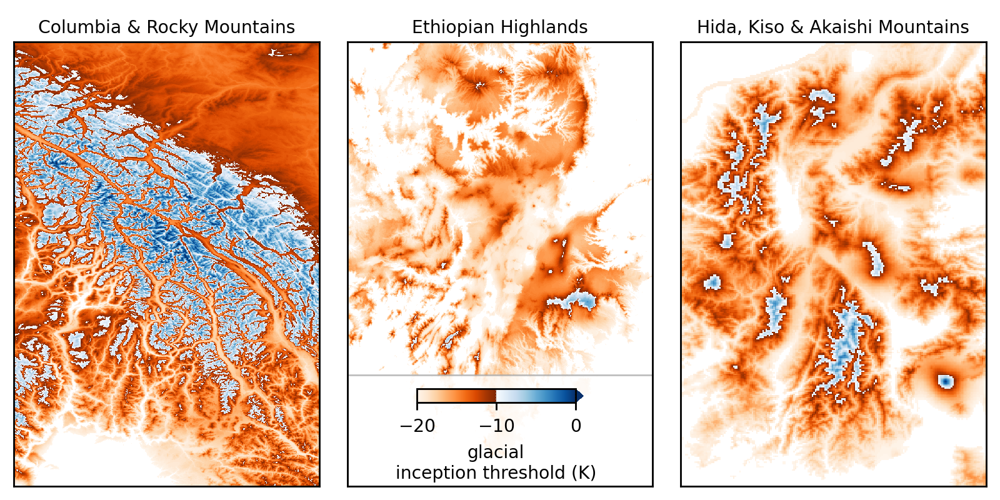
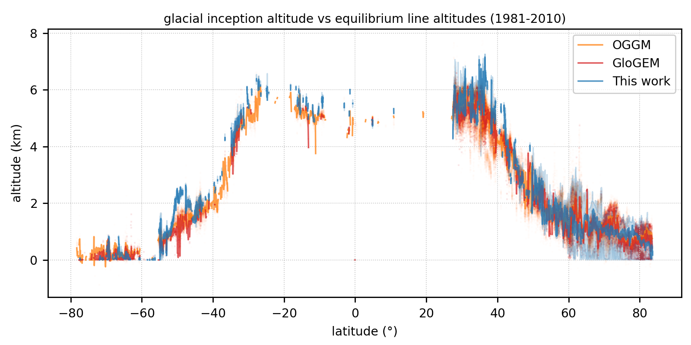

<!-- can't be moved to template -->
<section data-markdown data-separator-notes="^:::">
<textarea data-template>

# Global glacial inception threshold

from positive degree-day modelling

~

[J. Seguinot](https://juseg.dev), M. Van Cappellen, E. Legrain, R. Aguayo, L. Van Tricht, A. Born, and H. Zekollari.
EGU, 29 Apr 2025.

::: TODO: add photo background

---

### Alpine glaciation
<!-- .element: style="display: none" -->

<!-- .slide: data-background-iframe="https://player.vimeo.com/video/294517816?autoplay=1&loop=1&color=ffffff&title=0&byline=0&portrait=0#t=100s" -->

---

### Global glaciation styles

See whiteboard

::: TODO: add figure

---

### Global degree-day modelling

- CHELSA-W5E5 ca. 1 km input climate (T, P, σ)
- Temperature offset +4.0, +3.8, ..., -20.0 K
- Temperature-index accumulation and ablation model

~

→ Global **glacial inception threshold** 
(temperature change needed to begin glacier growth)

---

### Glacial inception threshold

Blablabla

---

### Local glacial inception

Blablabla

---

### Vs. current equilibrium lines

A null threshold corresponds to present-day ELA

TODO: add data from Lander

---

### Vs. PMIP4 and LGM equilibrium lines

See Marijke's poster for more detailed comparison.

---

### Thank you slide

Belgium inception threshold?

Bglacier photo?

<!-- can't be moved to template -->
</textarea>
</section>
