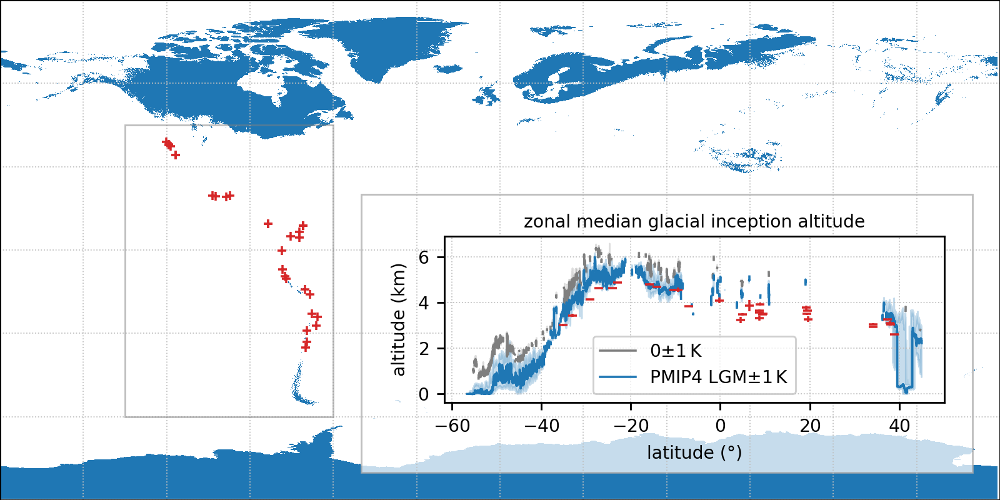
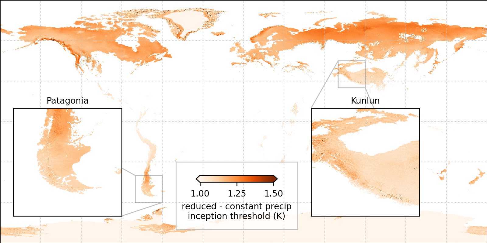

<!-- can't be moved to template -->
<section data-markdown data-separator-notes="^:::">
<textarea data-template>

# Global glacial inception threshold   from positive degree-day modelling

<!-- .element: style="padding-top: 2em; text-shadow: 0 0 100px #000;" -->

<!-- .slide: data-background-image="https://live.staticflickr.com/65535/48968011203_c9c640445c_k.jpg" -->

<!-- **Global glacial inception threshold from positive degree-day modelling.** -->
[J. Seguinot](https://juseg.dev), M. Van Cappellen, E. Legrain, R. Aguayo, L.
Van Tricht, A. Born, and H. Zekollari. VUB, 4 Jun 2025.

---

### Glaciers and paleoglaciers

  
  

  -4.8±2.5°C 
  (Kageyama et al., 2021)

<!-- .element: class="blue fragment" style="bottom: 0; margin: 0; padding: 3em; position: absolute" -->

---

### Global degree-day modelling

- CHELSA-W5E5 ca. 1 km input climate (T, P, σ)
- Temperature offset +5.0, +4.8, ..., -20.0 K
- Postive degree-day mass balance  model

~

→ Global **glacial inception threshold** 
(temperature change needed to begin glacier growth)

---

### Input climatology

---

### Glacial inception threshold

---

### Glacial inception threshold

---

### Glacial inception threshold

---

### Glacial inception areas

---

### Vs. current equilibrium lines

  
  
  

---

### Vs. PMIP4 and LGM equilibrium lines

See also poster **EGU25-6672** by Van Cappellen et al.

---

### Glacial inception on the Austria Center

  

    
  

  

    
(but glaciers from the Alps would flow here first)

    

      
      
    

    

      
    

  

---

### Glacial inception in Belgium

---

### Sensitivity to precipitation

---

### Sensitivity to PDD factor

---

### Sensitivity to input climate

---

### Open questions

  

- Include warmer climates (a.k.a
glacial deception threshold)?
- CHELSA-ERA5 vs -W5E5?
- Calibrate degree-day factor?
- More validation against PMIP4?

  

    
  

<!-- can't be moved to template -->
<!-- can't be moved to template -->
</textarea>
</section>
