<!-- can't be moved to template -->
<section data-markdown data-separator-notes="^:::">
<textarea data-template>

# Global glacial inception threshold reveals <br> concealed glaciation on Japanese volcanoes

<!-- .element: style="padding-top: 4em; text-shadow: 0 0 100px #000;" -->

<div class="titlebox">

<!-- .slide: data-background-image="https://live.staticflickr.com/65535/54855949773_43d970b093_k.jpg" -->

[J. Seguinot](https://juseg.dev), M. Van Cappellen, E. Legrain, R. Aguayo, L.
Van Tricht, A. Born, and H. Zekollari. *Hokkaido Univ.*, 15 Oct 2025.

</div>

---

### Last glacial cycle in the Alps

<!-- .element: style="display: none" -->

<!-- .slide: data-background-iframe="https://player.vimeo.com/video/294517816?autoplay=1&loop=1&color=ffffff&title=0&byline=0&portrait=0#t=00s" -->

---

### Glaciers and paleoglaciers

<div class="r-stack">
  
  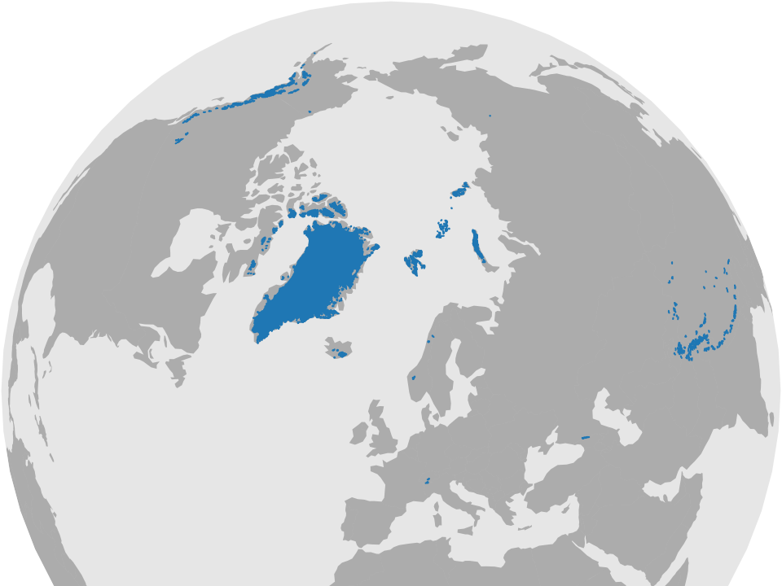
  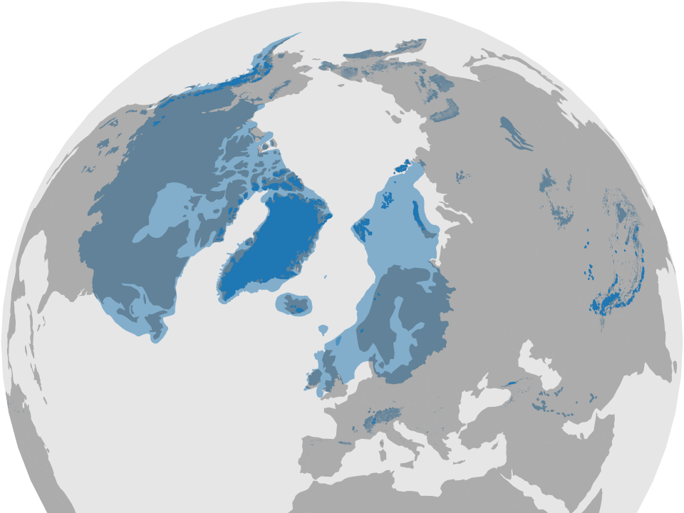
  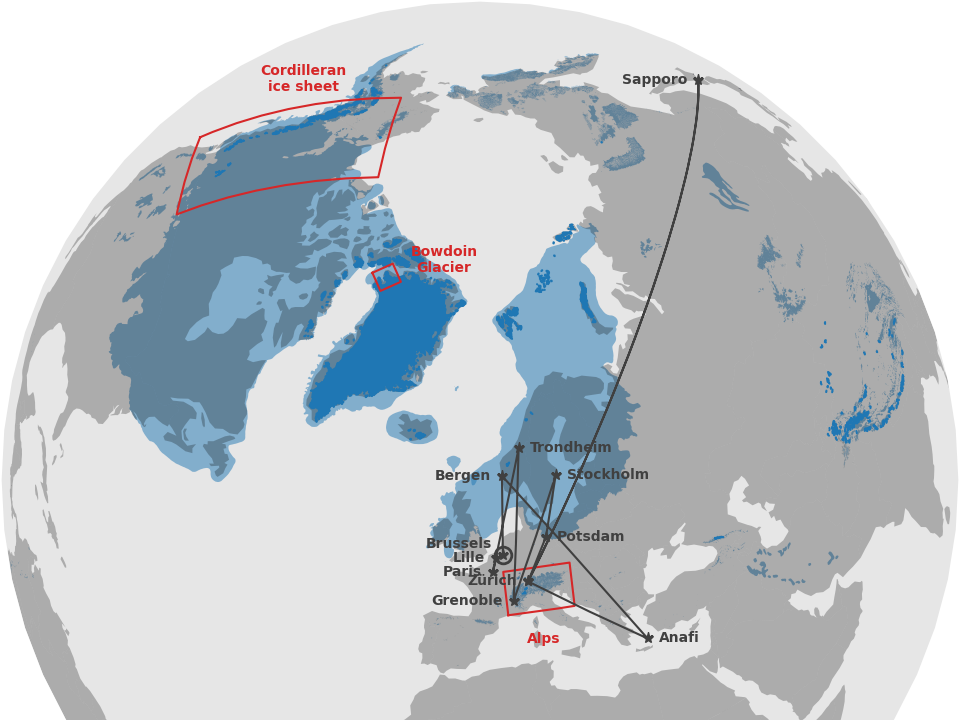
</div>
<div class="fragment" data-fragment-index="4">
  <span style="font-size: 1.5em">-4.8±2.5°C</span></br>
  <span style="font-size: 0.75em">(Kageyama et al., 2021)</span>
</div>

<!-- .element: class="blue fragment" style="bottom: 0; margin: 0; padding: 3em; position: absolute" -->

---

<!-- .slide: data-auto-animate -->
### Alps modelling workflow

<div class='flex'>
 <div class='box flex' data-id='hyoga' style='border: none'>
  <div>
   <div class='box' data-id='t'>T</div>
   <div class='box' data-id='p'>P</div>
   <div class='box' data-id='z'>z</div>
  </div>
  <div data-id='arrow1'>→</div>
  <div>
   <div class='box blue'>Python
    <pre>pism-palseries</pre>
   </div>
   <div class='box green'>GRASS GIS
    <pre>r.in.worldclim.py</pre>
    <pre>r.out.pism.py</pre>
    <pre>...</pre>
   </div>
  </div>
  <div>
   <div class='box pink' data-id='pism'>PISM
    <pre>pism-palwrapper</pre>
   </div>
   <div>↓</div>
   <div class='box blue'>Python
    <pre>cartowik</pre>
    <pre>iceplotlib</pre>
    <pre>...</pre>
   </div>
  </div>
 </div>
 <div data-id='arrow2'>→</div>
 <div>
  <div class='box' data-id='nc'>.nc</div>
  <div class='box' data-id='pdf'>.pdf</div>
  <div class='box' data-id='mp4'>.mp4</div>
 </div>
</div>

---

<!-- .slide: data-auto-animate data-auto-animate-duration="2s" -->
### New modelling workflow

<div class='flex'>
 <div class='box blue flex' data-id='hyoga'>
  <div>
   <div class='box' data-id='t'>T</div>
   <div class='box' data-id='p'>P</div>
   <div class='box' data-id='z'>z</div>
  </div>
  <div data-id='arrow1' style='padding: 0.5em'>→</div>
  <div class='box purple' data-id='pism'>PISM</div>
  <div style='align-self: start; padding: 1em'>hyoga</div>
 </div>
 <div data-id='arrow2' style='padding: 0.5em'>→</div>
 <div>
  <div class='box' data-id='nc'>.nc</div>
  <div class='box' data-id='pdf'>.pdf</div>
  <div class='box' data-id='mp4'>.mp4</div>
 </div>
</div>

---

### Hyoga paleoglacier modelling framework

```python [4-7|9-11|13-14|16-17]
import hyoga
import xarray

# coordinate system and bounds
domain = dict(
    crs='epsg:32632',
    bounds=[150e3, 4820e3, 1050e3, 5420e3])

# input files
hyoga.open.bootstrap(**domain).to_netcdf('boot.nc')
hyoga.open.atmosphere(**domain).to_netcdf('atm.nc')

# TODO run PISM
# pismr -i boot.nc [...] -o out.nc

# plot output
xarray.open_dataset('out.nc').hyoga.plot.ice_margin()
```

User guide and API docs at https://hyoga.io.

---

### Online documentation

<iframe data-src="https://hyoga.io" width="960" height="540"></iframe>

---

### Glaciation modes

<div class="r-stack r-stretch">
  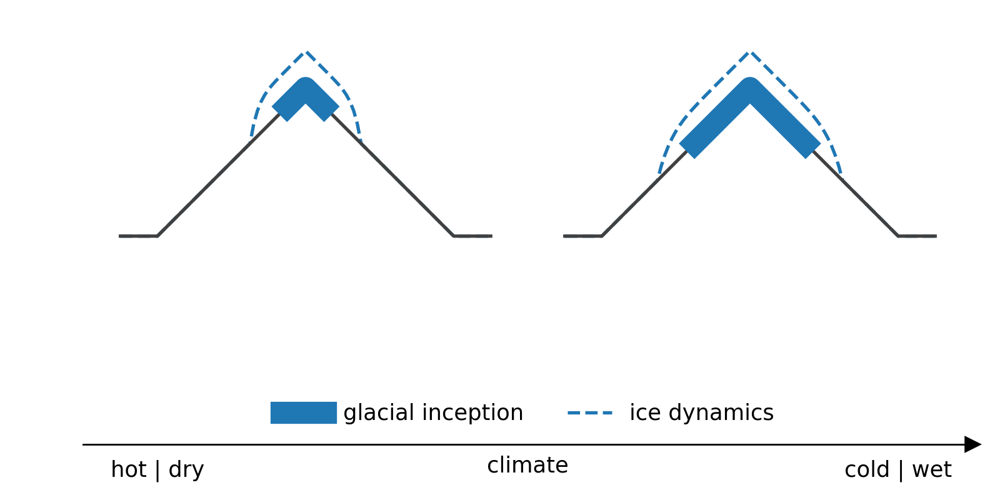
  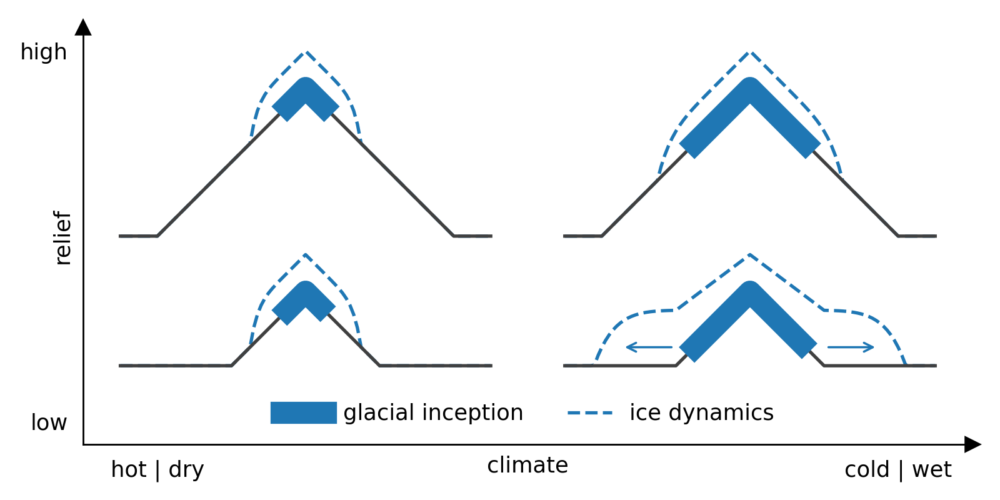
</div>

---

### Global degree-day modelling

- CHELSA-W5E5 ca. 1 km input climate (T, P, σ)
- Temperature offset +5.0, +4.8, ..., -20.0 K
- Postive degree-day mass balance  model

~

→ Global **glacial inception threshold**<br>
(temperature change needed to begin glacier growth)

---

### Input climatology

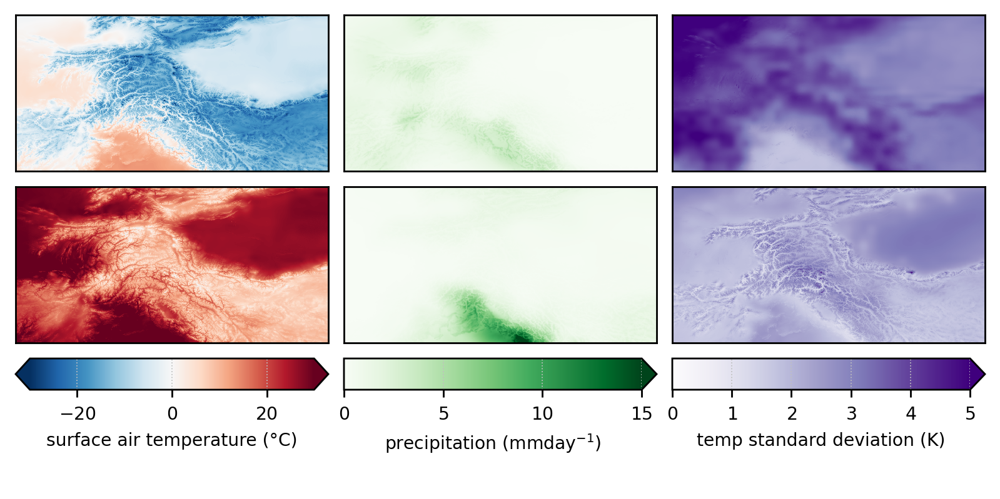

---

### Glacial inception threshold

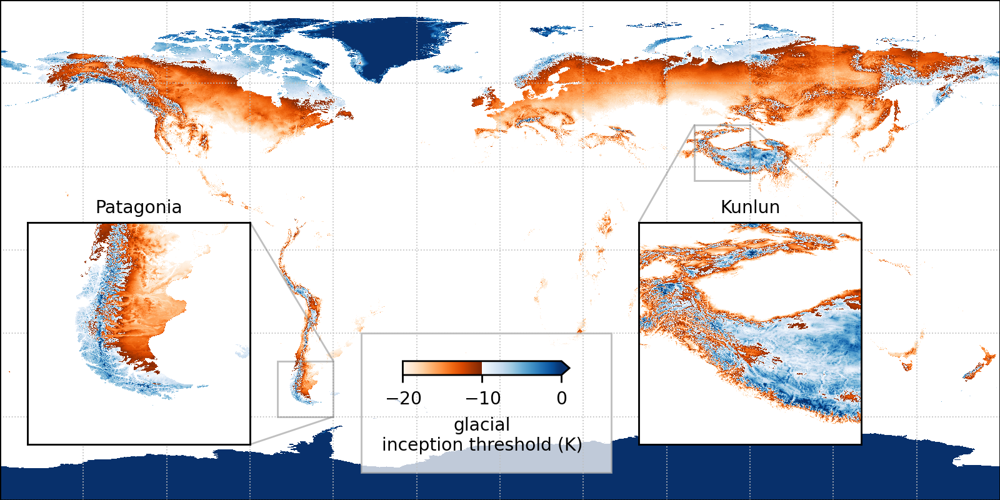

---

### Glacial inception threshold

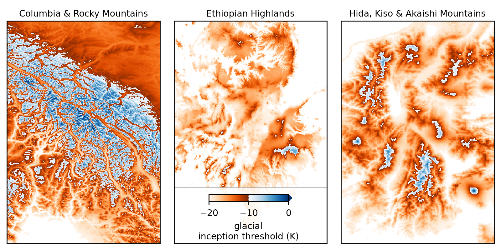

---

### Vs. current equilibrium lines

<div class="r-stack r-stretch">
  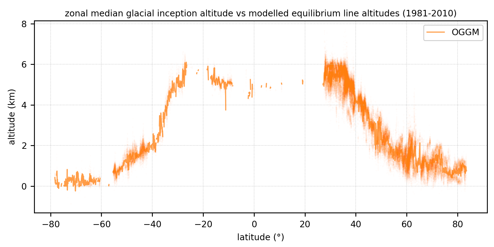
  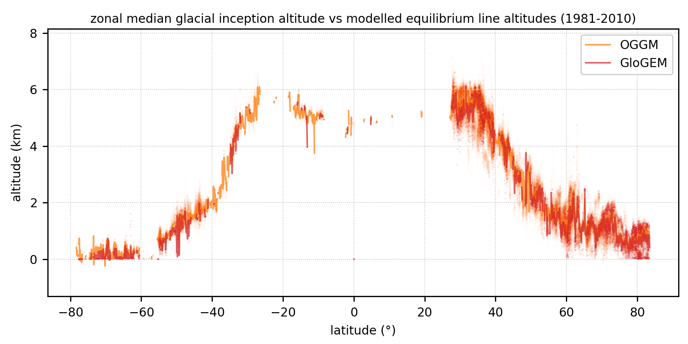
  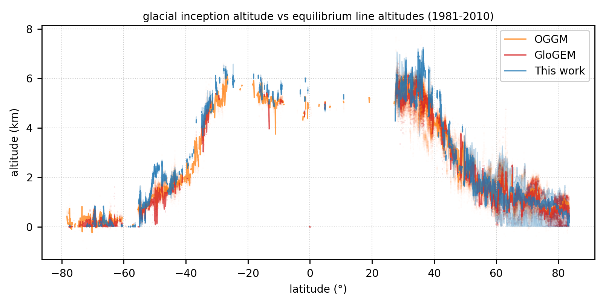
</div>

---

### Vs. PMIP4 and LGM equilibrium lines

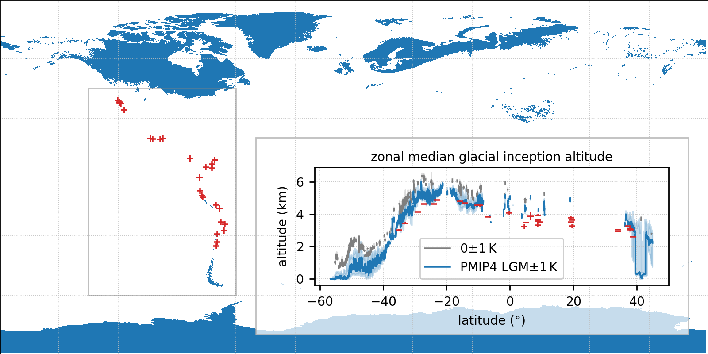

---

### Glacial inception threshold in Japan

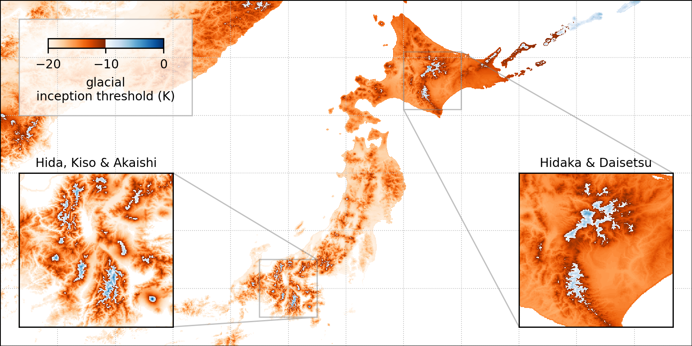

---

### Regional downscaling

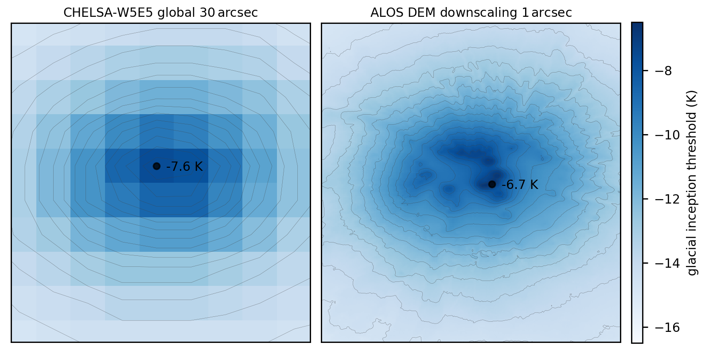

---

### Glacial inception threshold in Japan

<div class="multicol">
  <div class="column">
      
  </div>
  <div class="column fragment">

- Reproduced known glaciers on
  - Honshu (*Hida*, *Kiso*, and *Akaishi*)
  - and Hokkaido (*Hidaka*).

- But also where evidence is
  - either limited (*Daisetzu*)
  - or missing (*Fuji* and *Ontake*).

⟹ Volcanism may have hindered or overprinted the glacial record.

  </div>
</div>

---

### Special thanks and an anecdote

<div class="multicol">
  <div class="column">
    <div style="background: white; padding: 0 1em">
    
      
    </div>
    <p>Glaciers, ice flow, mass balance, hydrology, blue ice, meteorites...</p>
  </div>
  <div class="column fragment">
    <iframe width="400" height="540" style="margin: 0"
      data-src="https://ishidamikio.sakura.ne.jp"></iframe>
  </div>
</div>

---

### Sensitivity to precipitation

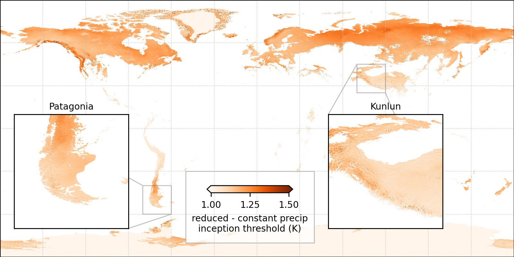

---

### Sensitivity to input climate

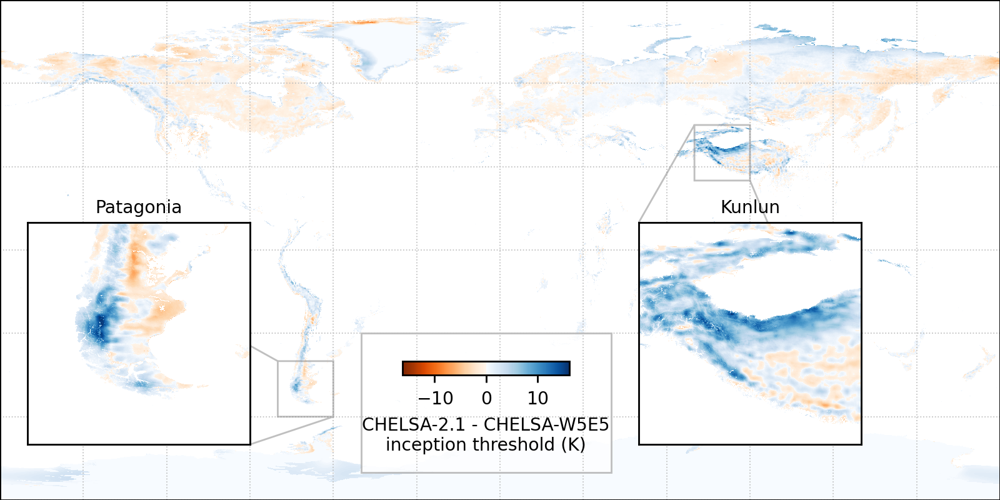

<!-- can't be moved to template -->
<!-- can't be moved to template -->
</textarea>
</section>
