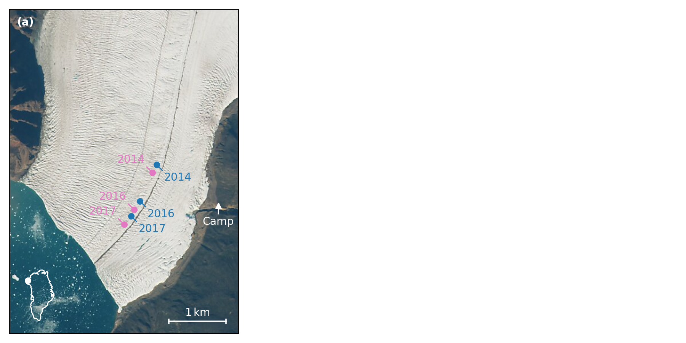
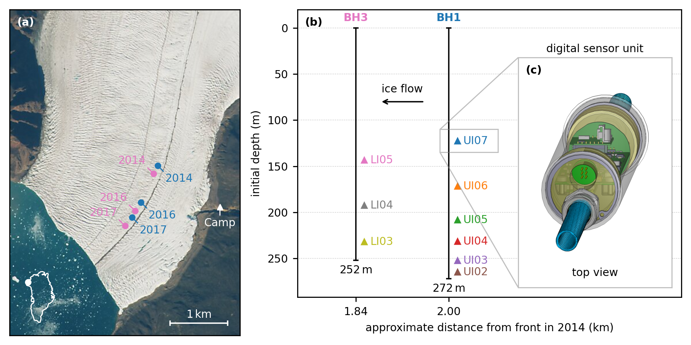

<!-- can't be moved to template -->
<section data-markdown data-separator-notes="^:::">
<textarea data-template>

# Can we measure stress in glaciers?
<!-- .slide: data-background-image="https://live.staticflickr.com/65535/49298829236_2546afe01d_k.jpg" -->

[Julien Seguinot](https://juseg.dev), Evgeny A. Podolskiy, Shin Sugiyama,
Harry Zekollari. **Return of the Bowdoin Glacier: measuring the dark side of the force**. *ISAR-8*, 29 Oct 2025.
<!-- .element: class="titlebox fragment fade-out" data-fragment-index="1" -->

::: TODO
- partial figures for boreholes, timeseries, etc?
- highpass filter cut-off frequencies are different

---
### Bowdoin Glacier drilling site
<!-- .slide: data-background-image="https://live.staticflickr.com/65535/49298343083_3bfbd1cc01_k.jpg" -->

---
### Bowdoin borehole locations

  
  
  

---
### Three-year borehole record

  
  
  
  
  
  

---
### Fast Fourier transform

  
  

---
### Rolling-window spectrograms

---
### Sub-daily filtering

  
  

---
### Cross-correlation over a month

  
  
  

---
### Rolling-window cross-correlation

---
### Thank you
<!-- .slide: data-background-image="https://live.staticflickr.com/65535/54855949773_43d970b093_k.jpg" -->

<!-- can't be moved to template -->
</textarea>
</section>
