<!-- can't be moved to template -->
<section data-markdown data-separator-notes="^:::">
<textarea data-template>

# Measuring shear and stress   in Bowdoin Glacier, Northwest Greenland
<!-- .slide: data-background-image="https://live.staticflickr.com/65535/49298829236_2546afe01d_k.jpg" -->

[Julien Seguinot](https://juseg.dev), Evgeny A. Podolsky, Ralf Greve, Shin Sugiyama, Harry Zekollari. *Taiwan Polar Institute*, 3 Dec 2025.
<!-- .element: class="titlebox fragment fade-out" data-fragment-index="1" -->

---
### Self-introduction
<!-- .slide: data-background-image="https://live.staticflickr.com/65535/49298829236_2546afe01d_k.jpg" -->

---
### Glaciers and paleoglaciers

  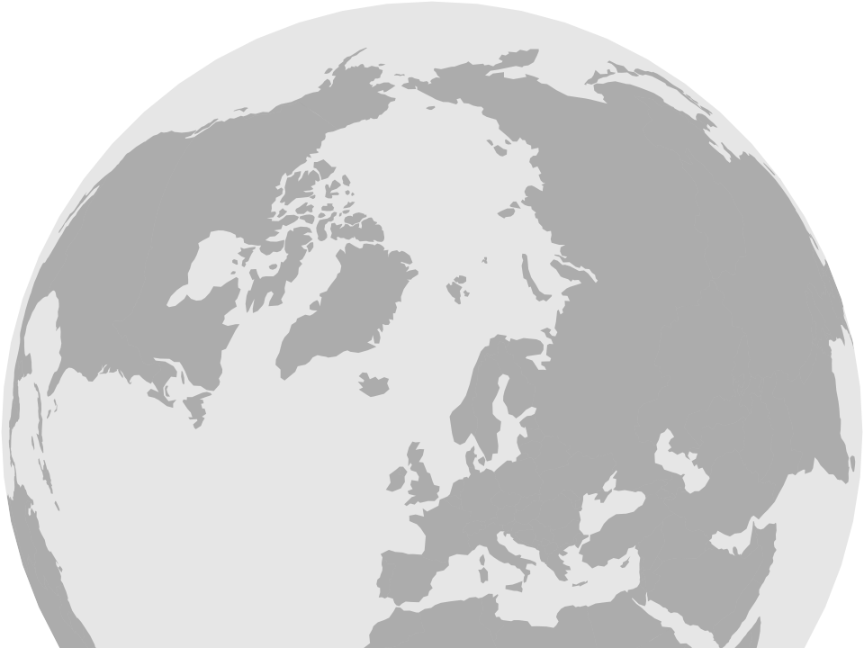
  
  
  
  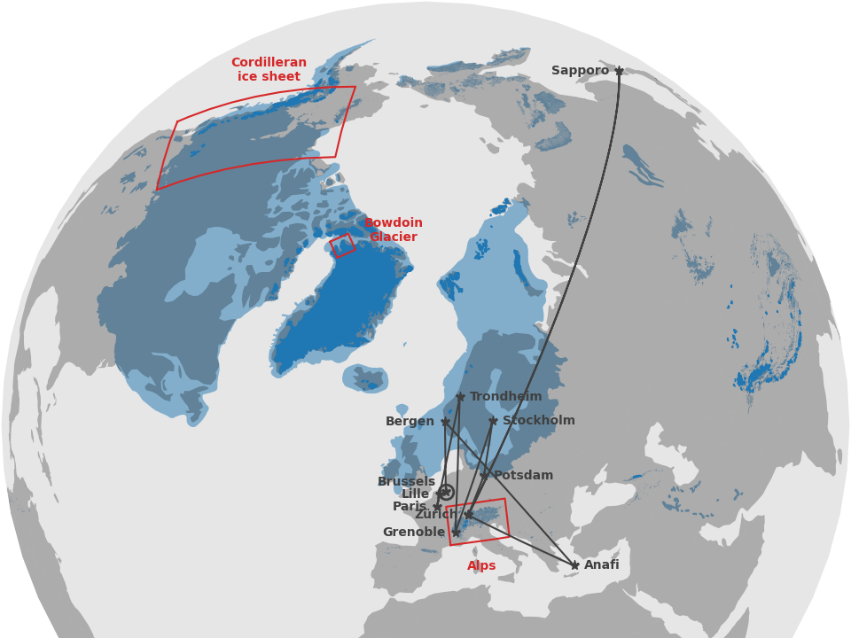

  -4.8±2.5°C 
  (Kageyama et al., 2021)

<!-- .element: class="blue fragment" style="bottom: 0; margin: 0; padding: 3em; position: absolute" -->

---
### Last glacial cycle in the Alps
<!-- .element: style="display: none" -->
<!-- .slide: data-background-iframe="https://player.vimeo.com/video/294517816?autoplay=1&loop=1&color=ffffff&title=0&byline=0&portrait=0#t=00s" -->

---
### Global glacial inception threshold

And downscaling for Japanese and Taiwanese mountains 
(**Fri 5 Dec**, *Institute of Hydrological and Oceanic Science*).

---
### Bowdoin Glacier temperature data
<!-- .slide: data-background-image="https://live.staticflickr.com/65535/49298829236_2546afe01d_k.jpg" -->

---
### Bowdoin Glacier drilling sites

---
### Complete borehole setup

---
### Temperature time series

---
### Temperature profiles

---
### Ogives pattern

---
### Bowdoin Glacier tilt data
<!-- .slide: data-background-image="https://live.staticflickr.com/65535/49298829236_2546afe01d_k.jpg" -->

---
### Bowdoin tilt units

  
  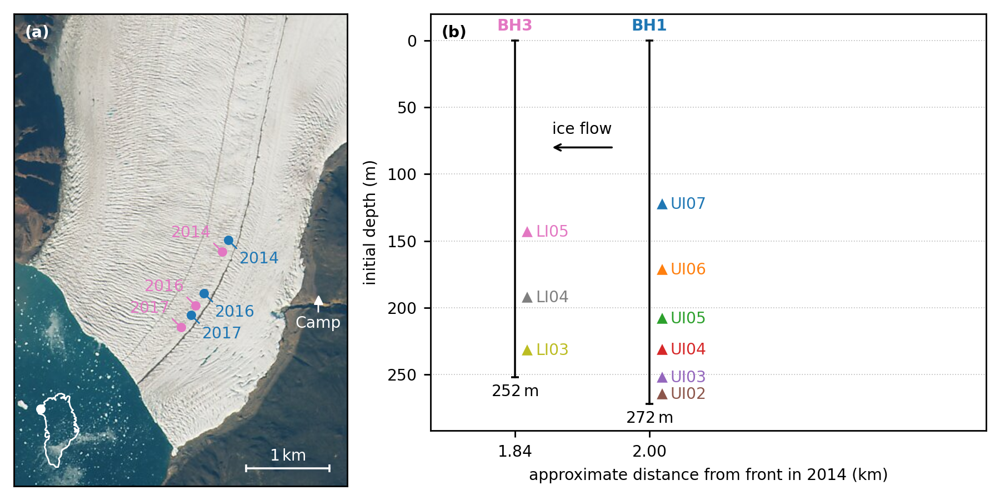
  

---
### Tilt data

---
### Tilt rates

---
### Shear profile

---
### Bowdoin Glacier stress data
<!-- .slide: data-background-image="https://live.staticflickr.com/65535/49298829236_2546afe01d_k.jpg" -->

---
### Bowdoin borehole locations

  
  
  

---
### Three-year borehole record

  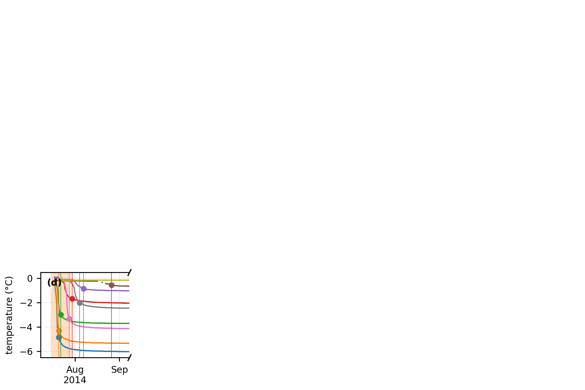
  
  
  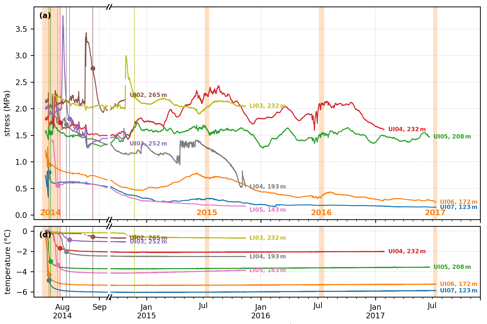
  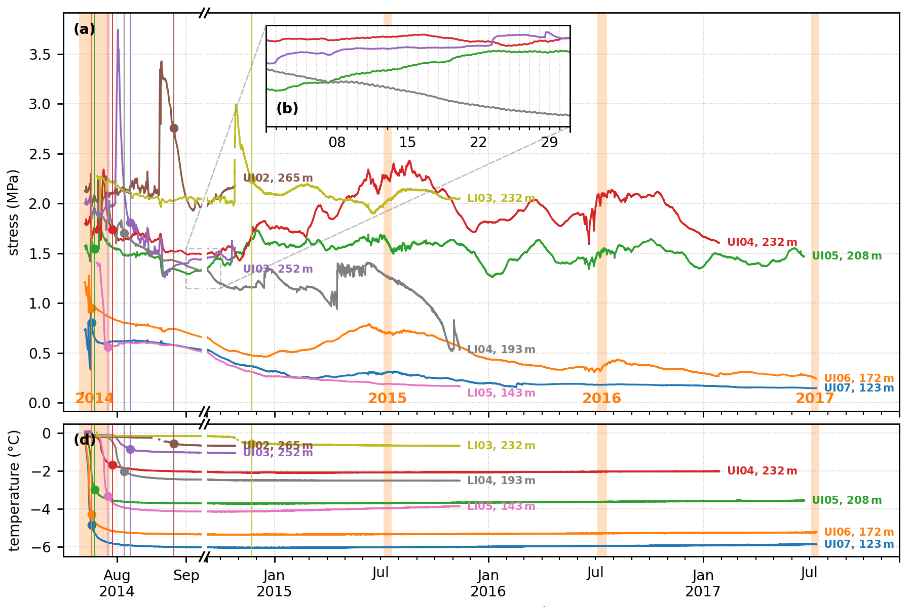
  

---
### Fast Fourier transform

  
  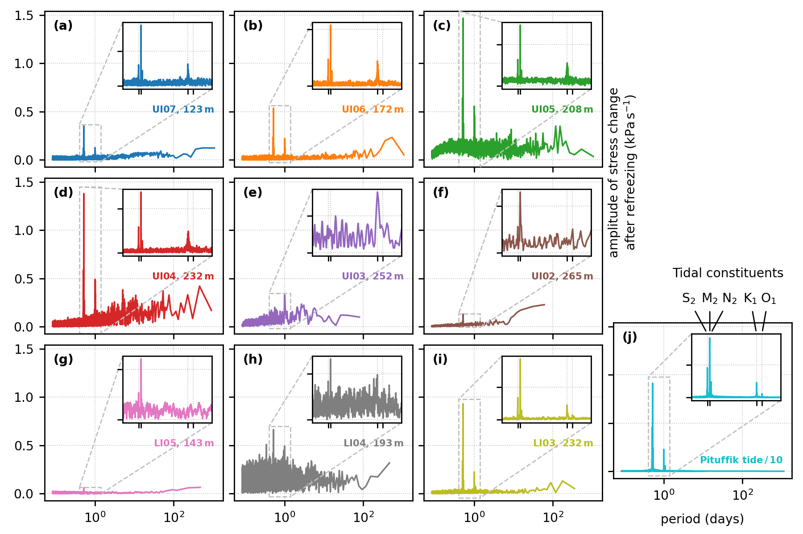

---
### Moving window spectrograms

---
### Sub-daily filtering

  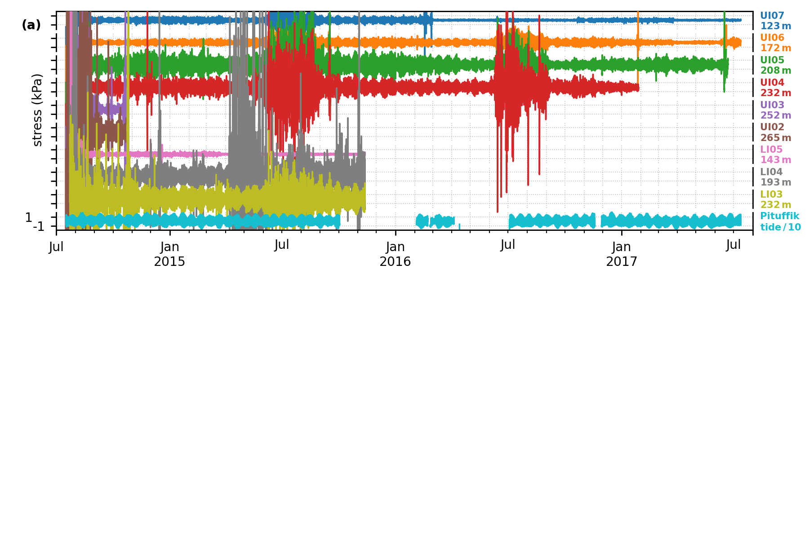
  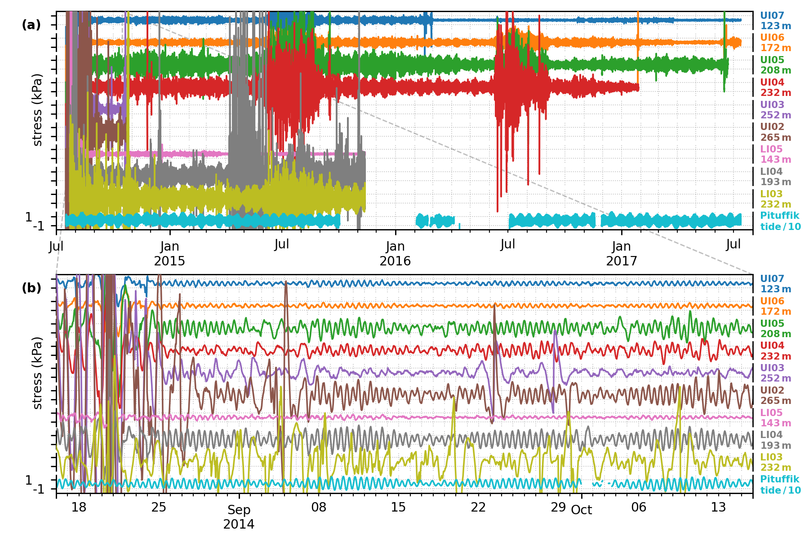

---
### Cross-correlation over a month

  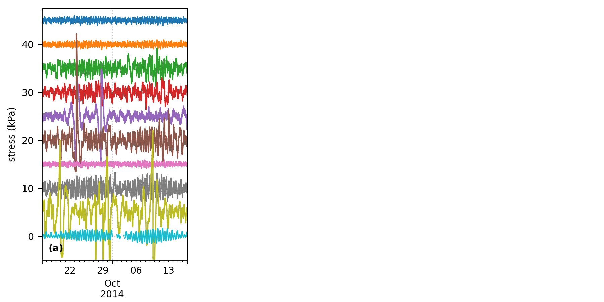
  
  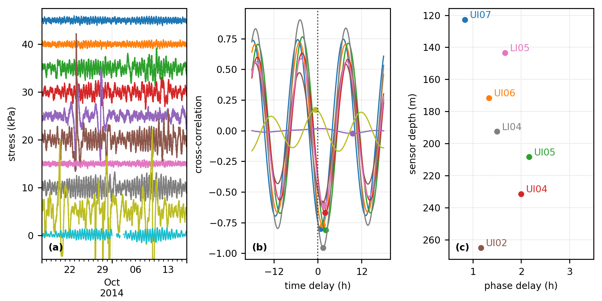

---
### Moving window cross-correlation
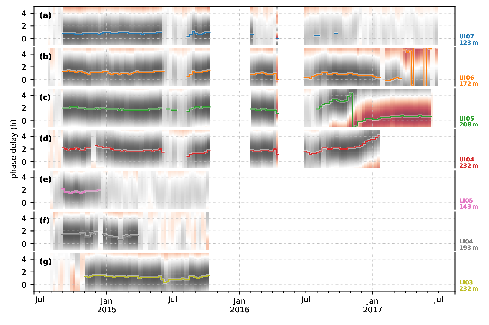

---
### Conclusions

<!-- - Temperature -->
<!-- - Deformation -->
<!-- - Stress -->

<!-- Temperature profiles from two drilling sites separated by 158 (2014) to 191 m (2017) differ by up to ca. 2◦ C indicating strong, full-depth longitudinal temperature variations in the glacier. -->
<!-- Englacial warming up to 0.39◦ C a−1 , an order of magnitude above the theoretical warming from heat diffusion and viscous dissipation, indicates a deep and local heat source within the tidewater glacier. -->
<!-- In the absence of visible moulins on the glacier surface, we interpret these results as the expression of latent heat released from meltwater refreezing in crevasses reaching to, or near to, the base of the glacier. -->
<!-- We speculate that the localization of such deep crevasses may be controlled by preferential meltwater infiltration in topographic dips associated with ogive banding. -->

<!-- Paper: J. Seguinot, M. Funk, A. Bauder, T. Wyder, C. Senn and S. Sugiyama. Englacial warming indicates deep crevassing in Bowdoin Glacier, Greenland, Frontiers in Earth Sciences, 8:65, doi:10.3389/feart.2020.00065, 2020. -->

---
### Thank you

    

    
      
    

    
Glaciers, ice flow, mass balance, hydrology, blue ice, meteorites...

<!-- can't be moved to template -->
</textarea>
</section>
