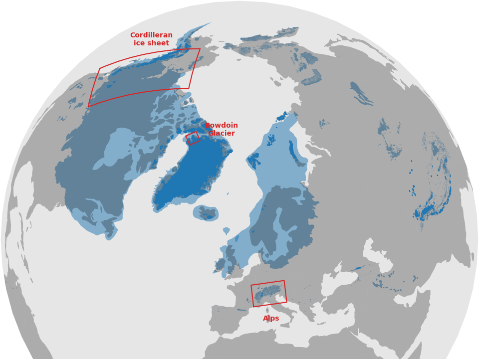
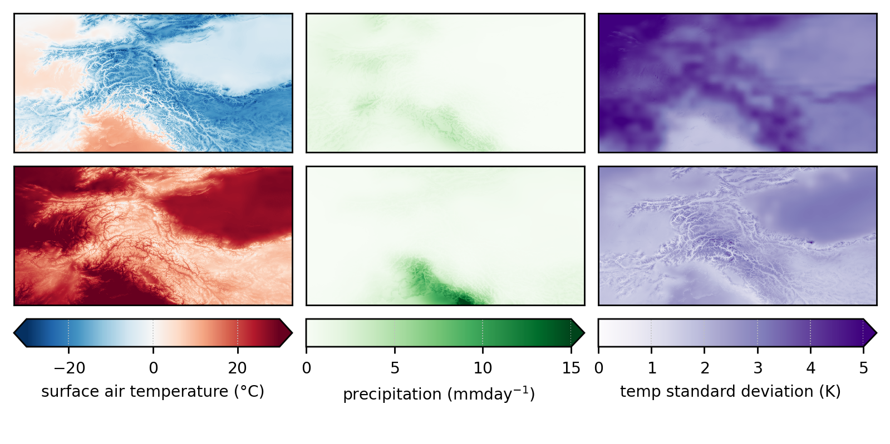
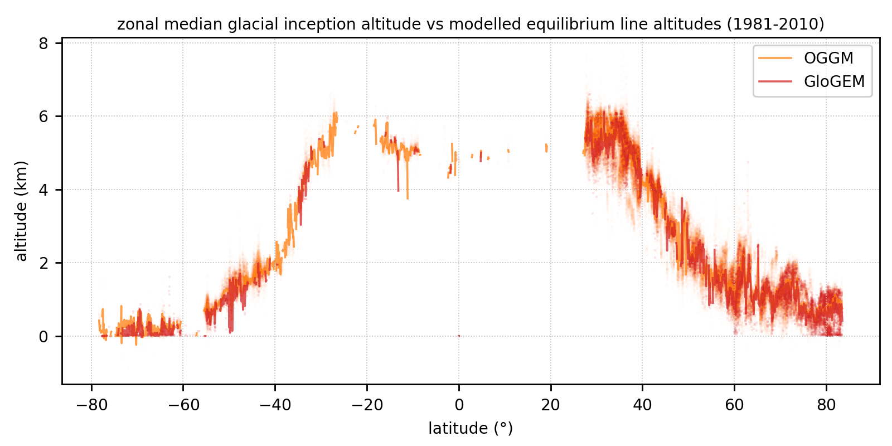
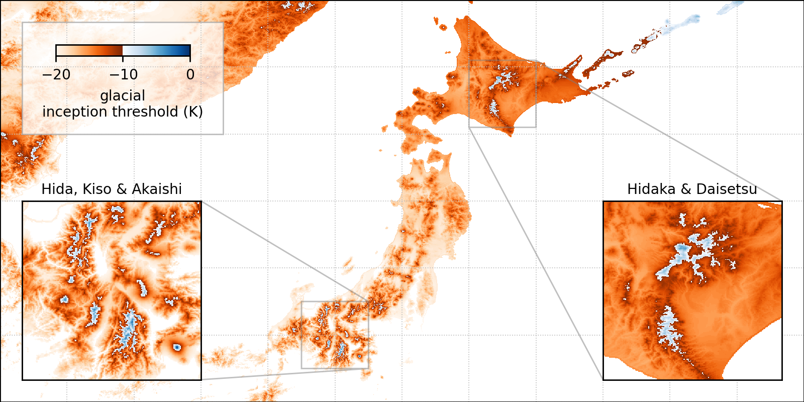
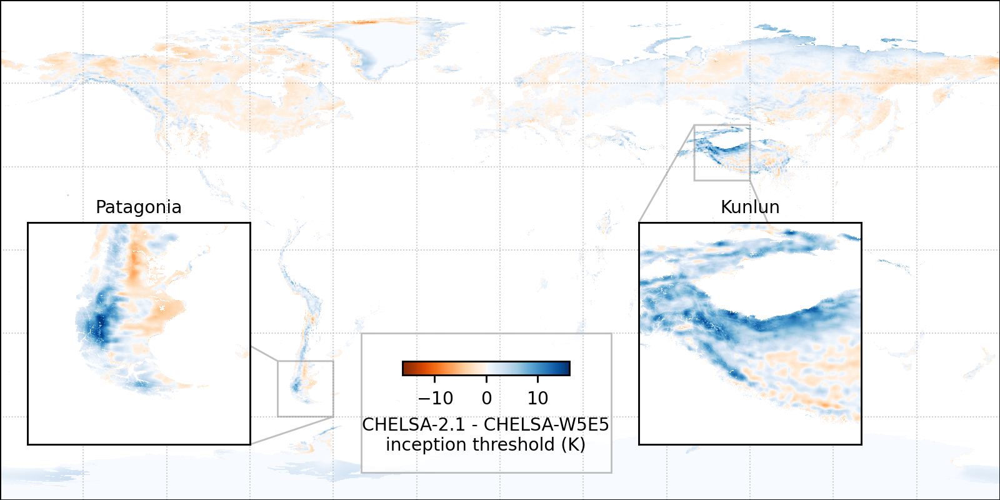

<!-- can't be moved to template -->
<section data-markdown data-separator-notes="^:::">
<textarea data-template>

<!-- 1. ALPS GLACIAL CYCLE -------------------------------------------------->

# Global glacial inception threshold <br> and downscaling over Japan and Taiwan
<!-- .element: style="padding-top: 4em; text-shadow: 0 0 100px #000;" -->
<!-- .slide: data-background-image="https://live.staticflickr.com/65535/54855949773_43d970b093_k.jpg" -->
<div class="titlebox">

[J. Seguinot](https://juseg.dev), M. Van Cappellen, E. Legrain, R. Aguayo, L.
Van Tricht, A. Born, and H. Zekollari. *Hokkaido Univ.*, 15 Oct 2025.

</div>

---
### Gorner Glacier, CH
<!-- .slide: data-background-image="https://live.staticflickr.com/65535/53678099600_2d9af5dcc9_k.jpg" -->
Photo: [2017](https://www.flickr.com/photos/pyjeo/53678099600/)
<!-- .element: class="credit" -->
::: An active deglaciation landscape in the Alps:
- Gorner Glacier has recently become two glaciers.
- I want you to look at the Little Ice Age moraines.
- The landscape record is sparse in time and space.

---
### Tuya Lake, CA
<!-- .slide: data-background-image="https://live.staticflickr.com/65535/49298982311_52f533df57_k.jpg" -->
[Menounos et al, 2017](https://doi.org/10.1126/science.aan3001);
photo: [2012](https://www.flickr.com/photos/pyjeo/49298982311/)
<!-- .element: class="credit" -->
::: Typically we look at geological time scales.
- We sampled rocks and dated the moraine to the Younger Dryas.
- This moraine is unique in hundreds of kilometers.
- The landscape record is sparse in time and space.

---
### Valle Verzasca, CH
<!-- .slide: data-background-image="https://live.staticflickr.com/65535/48844296952_0d9aa1b952_k.jpg" -->
Photo: [2017](https://www.flickr.com/photos/pyjeo/48844296952/)
<!-- .element: class="credit" -->

---
### Last glacial cycle in the Alps
<!-- .element: style="display: none" -->
<!-- .slide: data-background-iframe="https://player.vimeo.com/video/294517816?autoplay=1&loop=1&color=ffffff&title=0&byline=0&portrait=0#t=00s" -->

<!-- 2. ALPS GLACIAL EROSION ------------------------------------------------>
---
### Erosion rate animation
<!-- .element: style="display: none" -->
<!-- .slide: data-background-iframe="https://player.vimeo.com/video/503162771?autoplay=1&loop=1&color=ffffff&title=0&byline=0&portrait=0" -->

---
### Erosion volumes animation
<!-- .element: style="display: none" -->
<!-- .slide: data-background-iframe="https://player.vimeo.com/video/512478926?autoplay=1&loop=1&color=ffffff&title=0&byline=0&portrait=0" -->

---
### More on the Alps

- J. Seguinot, S. Ivy-Ochs, G. Jouvet, M. Huss, M. Funk, and F. Preusser.
  Modelling last glacial cycle ice dynamics in the Alps.
  [The Cryosphere](https://doi.org/10.5194/tc-12-3265-2018), 2018.

- J. Seguinot and I. Delaney.
  Last-glacial-cycle glacier erosion potential in the Alps.
  [ESurf](https://doi.org/10.5194/esurf-9-923-2021), 2021.

- Datasets
  ([aggregated](https://doi.org/10.5281/zenodo.1423159),
   [continuous](https://doi.org/10.5281/zenodo.1423175),
   [erosion](https://doi.org/10.5281/zenodo.4495418))

https://juseg.dev/publications/

Please download & re-use!

<!-- 3. GLACIAL INCEPTION THRESHOLD ----------------------------------------->
---
### Going global
<div class="r-stack">
  
  
  
  
  
</div>
<div class="fragment" data-fragment-index="3">
  <span style="font-size: 1.5em">-4.8±2.5°C</span></br>
  <span style="font-size: 0.75em">(Kageyama et al., 2021)</span>
</div>
<!-- .element: class="blue fragment" style="bottom: 0; margin: 0; padding: 3em; position: absolute" -->
::: How to do this globally:
- Not so much so for the continental ice sheets.
- But for the many less-studied mountain ranges.
- Also in Patagonia, New Zealand, Tasmania, etc.

---
<!-- .slide: data-auto-animate -->
### Alps modelling workflow

<div class='flex'>
 <div class='box flex' data-id='hyoga' style='border: none'>
  <div>
   <div class='box' data-id='t'>T</div>
   <div class='box' data-id='p'>P</div>
   <div class='box' data-id='z'>z</div>
  </div>
  <div data-id='arrow1'>→</div>
  <div>
   <div class='box blue'>Python
    <pre>pism-palseries</pre>
   </div>
   <div class='box green'>GRASS GIS
    <pre>r.in.worldclim.py</pre>
    <pre>r.out.pism.py</pre>
    <pre>...</pre>
   </div>
  </div>
  <div>
   <div class='box pink' data-id='pism'>PISM
    <pre>pism-palwrapper</pre>
   </div>
   <div>↓</div>
   <div class='box blue'>Python
    <pre>cartowik</pre>
    <pre>iceplotlib</pre>
    <pre>...</pre>
   </div>
  </div>
 </div>
 <div data-id='arrow2'>→</div>
 <div>
  <div class='box' data-id='nc'>.nc</div>
  <div class='box' data-id='pdf'>.pdf</div>
  <div class='box' data-id='mp4'>.mp4</div>
 </div>
</div>

---
<!-- .slide: data-auto-animate data-auto-animate-duration="2s" -->
### New modelling workflow

<div class='flex'>
 <div class='box blue flex' data-id='hyoga'>
  <div>
   <div class='box' data-id='t'>T</div>
   <div class='box' data-id='p'>P</div>
   <div class='box' data-id='z'>z</div>
  </div>
  <div data-id='arrow1' style='padding: 0.5em'>→</div>
  <div class='box purple' data-id='pism'>PISM</div>
  <div style='align-self: start; padding: 1em'>hyoga</div>
 </div>
 <div data-id='arrow2' style='padding: 0.5em'>→</div>
 <div>
  <div class='box' data-id='nc'>.nc</div>
  <div class='box' data-id='pdf'>.pdf</div>
  <div class='box' data-id='mp4'>.mp4</div>
 </div>
</div>

---
### Hyoga paleoglacier modelling framework

```python [4-7|9-11|13-14|16-17]
import hyoga
import xarray

# coordinate system and bounds
domain = dict(
    crs='epsg:32632',
    bounds=[150e3, 4820e3, 1050e3, 5420e3])

# input files
hyoga.open.bootstrap(**domain).to_netcdf('boot.nc')
hyoga.open.atmosphere(**domain).to_netcdf('atm.nc')

# TODO run PISM
# pismr -i boot.nc [...] -o out.nc

# plot output
xarray.open_dataset('out.nc').hyoga.plot.ice_margin()
```

User guide and API docs at https://hyoga.io.

---
### Online documentation
<iframe data-src="https://hyoga.io" width="960" height="540"></iframe>

---
### Glaciation modes
<div class="r-stack r-stretch">
  
  
</div>

---
### Global degree-day modelling

- CHELSA-W5E5 ca. 1 km input climate (T, P, σ)
- Temperature offset +5.0, +4.8, ..., -20.0 K
- Postive degree-day mass balance  model

~

→ Global **glacial inception threshold**<br>
(temperature change needed to begin glacier growth)

---

### Input climatology


---

### Glacial inception threshold


---

### Glacial inception threshold


---

### Vs. current equilibrium lines
<div class="r-stack r-stretch">
  
  
  
</div>

---

### Vs. PMIP4 and LGM equilibrium lines


---

### Glacial inception threshold in Japan


---

### Regional downscaling


---
### Glacial inception threshold in Japan
<div class="multicol">
  <div class="column">
    
  </div>
  <div class="column fragment">

- Reproduced known glaciers on
  - Honshu (*Hida*, *Kiso*, and *Akaishi*)
  - and Hokkaido (*Hidaka*).

- But also where evidence is
  - either limited (*Daisetzu*)
  - or missing (*Fuji* and *Ontake*).

⟹ Volcanism may have hindered or overprinted the glacial record.

  </div>
</div>

---
### What about Taiwan?
<div class="multicol">
  <div class="column">
    
  </div>
  <div class="column fragment">

- Glacial inception threshold
    - -1.1 K 雪山 Xueshan
    - -2.7 K 南湖大山 Nanhu
    - -1.9 K 奇萊山 Qilai
    - -3.7 K 卓社大山 Zhuoshedashan
    - -5.2 K 玉山 Yushan

- Is this realistic?

  </div>
</div>

---
### Thank you
<div class="multicol">
  <div class="column" style="background: white; padding: 0 1em">
    
    
  </div>
  <div class="column" style="padding: 0 1em">

- **Bglacier:**
Glaciers, ice flow, mass balance, hydrology, blue ice, meteorites...
(https://hydr.vub.be/research-groups/bglacier)

- **Department of Water and Climate:**
Surface, groundwater hydrology, climate, glaciology
(https://hydr.vub.be)

  </div>
</div>

---
### Sensitivity to precipitation


---
### Sensitivity to input climate


<!-- can't be moved to template -->
<!-- can't be moved to template -->
</textarea>
</section>
